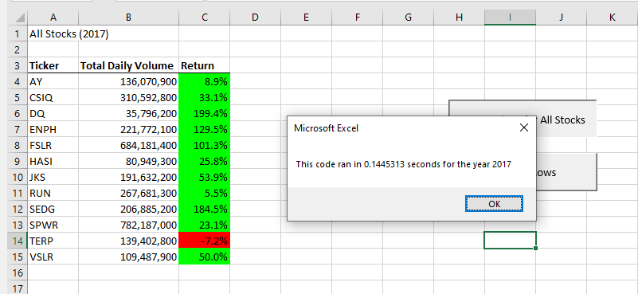
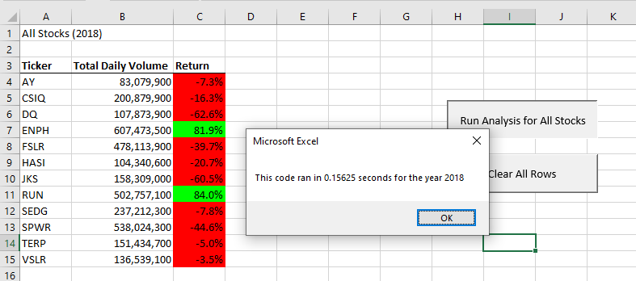

# Stocks Anlaysis

## Overview of Project

### Purpose

This project was designed to analyze the performance of green energy stocks for Steve and his parents, so that they can better invest in this industry.

---

## Analysis and Challenges

### Analysis of DQ stock (DQ Analysis)
This section of the project was used to analyze the performance of the stock ticker **DQ**, of which Steve's parents already own stock.

---

### Analysis of 12 stocks in the green energy sector (All Stocks Analysis)
This section of the project was used to analyze the performance of 12 different stocks within the green energy industry.

---

### Challenges and Difficulties Encountered
Some of the instructions for this project were less than clear, while others were just erroneous. This lead to some initial confusion, but was soon adjusted for in the final product.

---

## Results

- **DQ** stock performed extremely well in 2017, but sustained losses in 2018. 
  
- Most of the stocks in the industry analysis follow this trend, except for **RUN** and **ENPH**, which had gains for both years, and **TERP**, which had moderate losses both years.
  
- The following screenshots illustrate these outcomes, for 2017 and 2018:

---

## Summary

### Advantages and Disadvantages of Refactoring (in general)
- The advantage of refactoring is that it gives the programmer a chance to see the whole picture of what the code is trying to acheive, while not having to figure out everything from scratch. It usually allows for simplification and improving reusability.

- The disadvantage could be that it takes up more developer resources to accomplish the same goal.

### Advantages and Disadvantages of Refactoring (this VBA code)  
- For this analysis, the original code was slightly easier to read, and therefore more readily used by a second person, although it was slow. 

- The refactored code, on the other hand, was much faster, but became slightly more complex to read, as it had more 'moving parts'.

